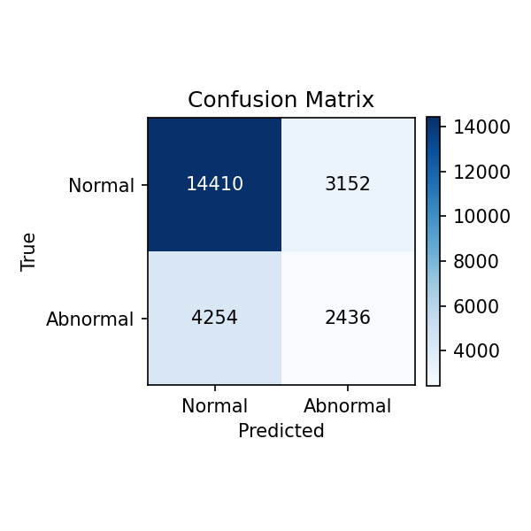
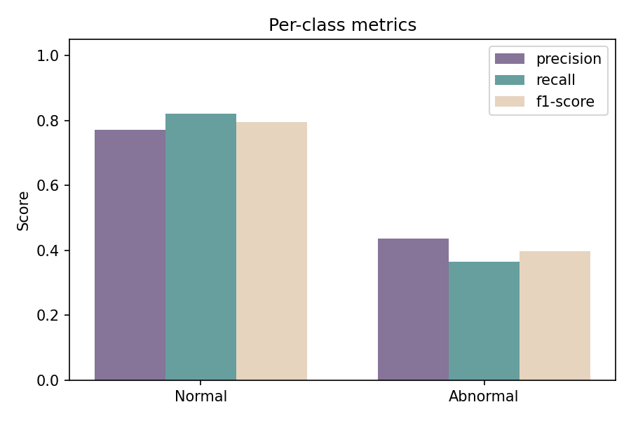
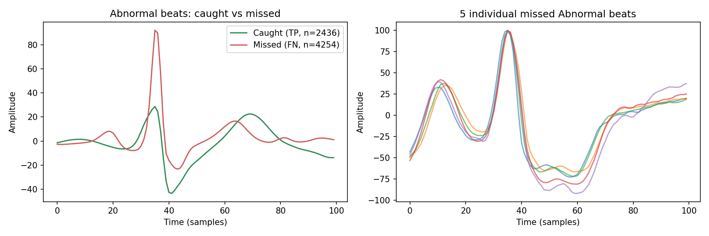
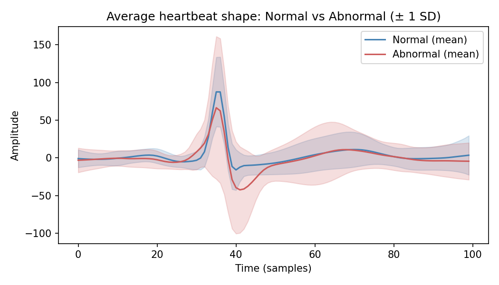
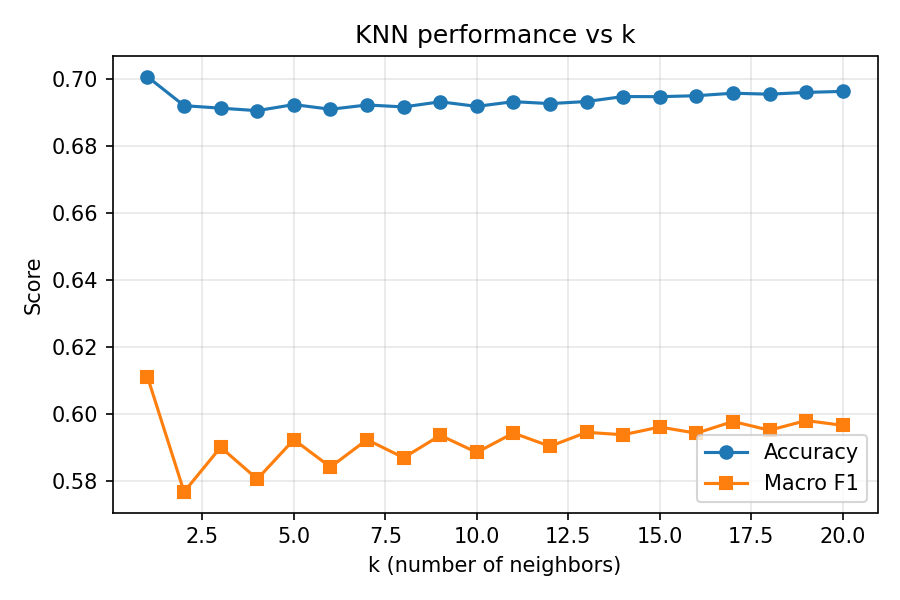

# ECG Binary Anomaly Detection (KNN)

The project is a simplified reimplementation of [andturken/ECG-Anomaly-Detection](https://github.com/andturken/ECG-Anomaly-Detection), reducing a 5-class, 3-model pipeline down to a single K-Nearest Neighbors classifier distinguishing **Normal** vs **Abnormal** heartbeats — built to deepen my understanding of the full ML pipeline (signal preprocessing, patient-level data leakage, hyperparameter tuning, and error analysis).

## Results

Trained and evaluated on the [MIT-BIH Arrhythmia Database](https://physionet.org/content/mitdb/1.0.0/) (103,504 heartbeats across 44 patients), with a **patient-independent train/test split** to prevent data leakage.

| Metric | Normal | Abnormal |
|---|---|---|
| Precision | 0.77 | 0.44 |
| Recall | 0.82 | 0.36 |
| F1-score | 0.80 | 0.40 |

**Macro F1: 0.60** &nbsp;|&nbsp; **Accuracy: 0.69** &nbsp;|&nbsp; Best params: k=15, weights=uniform




### Comparison to the original repo

| | Model(s) | Classes | Split | Macro F1 |
|---|---|---|---|---|
| Original repo | KNN, LogReg, Balanced RF | 5 (N, A, L, R, V) | Cross-patient-group | 0.48 |
| **This project** | **KNN only** | **2 (Normal / Abnormal)** | **Patient-independent** | **0.60** |


## Error analysis



Comparing correctly-classified vs. missed Abnormal beats shows the model reliably catches abnormal beats with a sharp, deep post-QRS trough, but consistently misses a subset whose shape (shallower trough, taller trailing wave) overlaps with Normal morphology. The five individually-plotted false negatives are strikingly similar to each other, suggesting one specific abnormality subtype is systematically confused with Normal beats — a limitation of using raw waveform amplitude with Euclidean-style distance, rather than random noise.




## What I changed vs. the original repo

- **Labels**: collapsed the original 5 classes (`N`, `A`, `L`, `R`, `V`) into 2 (Normal / Abnormal)
- **Model**: used KNN only 
- **Split**: patient-independent (`GroupShuffleSplit`) so no patient's beats appear in both train and test — the original leaky, beat-level split gave a misleading 99% weighted F1 before this fix
- **Hyperparameter tuning**: grid search over k (1–20) and neighbor weighting (`uniform` vs `distance`), optimized on macro F1 rather than accuracy/weighted F1, since the latter hides poor minority-class performance in an imbalanced dataset (~76% Normal / 24% Abnormal)
- **Signal preprocessing referenced** from the original repo 

## Tech stack

Python, NumPy, pandas, SciPy, scikit-learn, Matplotlib, Kaggle API, Google Colab

## Setup

```bash
pip install -r requirements.txt
```

Get the MIT-BIH dataset (Kaggle mirror, pre-converted to CSV):
```bash
pip install kaggle
export KAGGLE_API_TOKEN=your_token_here
kaggle datasets download -d mondejar/mitbih-database
unzip mitbih-database.zip -d mit_bih_csv
```

## Run

```bash
python download_preprocess_ecg.py   # signal processing -> data_ecg.pickle
python classify_ecg_knn_binary.py   # binary KNN training + evaluation
python plot_ecg_results.py          # generates the plots above
```

## Repo structure

```
├── download_preprocess_ecg.py   # signal processing (unchanged from original repo)
├── classify_ecg_knn_binary.py   # binary labels, patient split, KNN training/eval
├── plot_ecg_results.py          # confusion matrix, metrics, k-curve, error analysis
├── results_log.json             # logged run history (metrics and confusion matrix per run)
├── requirements.txt
├── .gitignore
└── Images/                      # saved result plots
    ├── confusion_matrix.png
    ├── class_metrics.png
    ├── error_analysis.png
    ├── average_waveforms.png
    └── k_selection_curve.png
```

## Future work

- **Address class imbalance directly** by trying SMOTE (oversampling) or class-weighted variants on the training set to see if Abnormal recall improves without a comparable loss in Normal precision
- **Cross-validated confidence intervals** and report macro F1 across multiple patient-group splits rather than a single held-out split, to see how stable the result is
- **Feature engineering** , extract clinically meaningful features (QRS width, R-R interval, P-wave presence) instead of using raw waveform points directly, and compare against the current raw-amplitude approach
- **Deploy a minimal demo** — a small Streamlit/Gradio app that takes a heartbeat segment and returns Normal/Abnormal, as a way to make the model interactively explorable

## Acknowledgments

Built on top of the signal preprocessing from [andturken/ECG-Anomaly-Detection](https://github.com/andturken/ECG-Anomaly-Detection). Dataset: [MIT-BIH Arrhythmia Database](https://physionet.org/content/mitdb/1.0.0/), PhysioNet.
